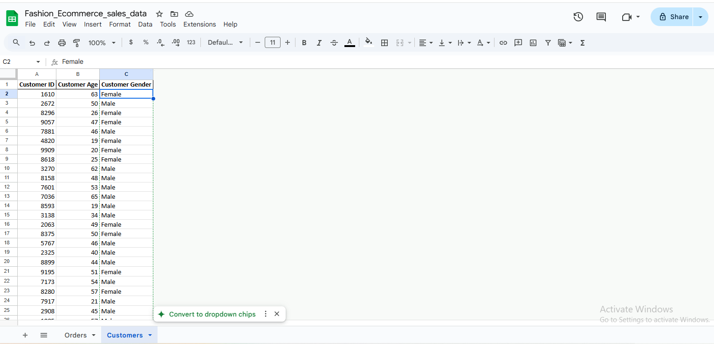
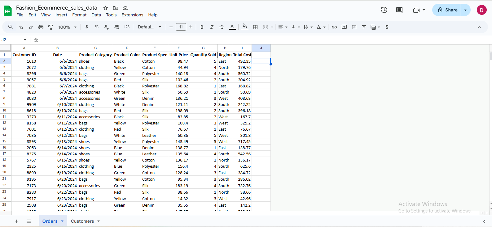
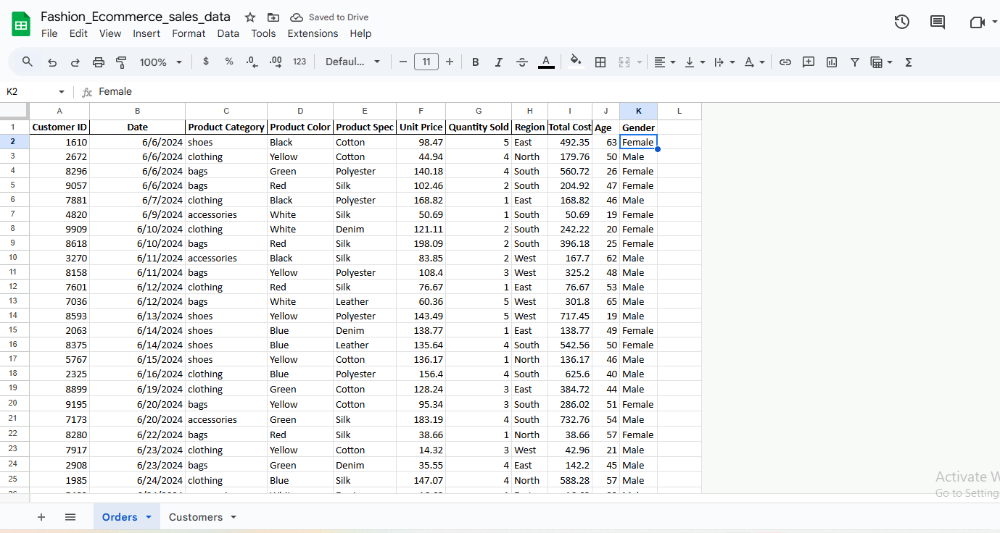
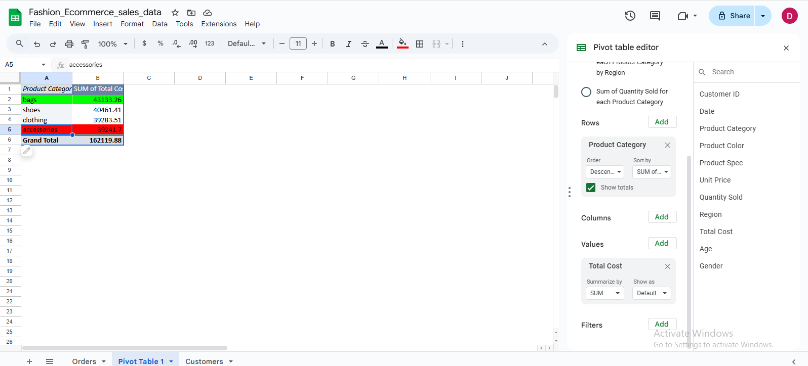
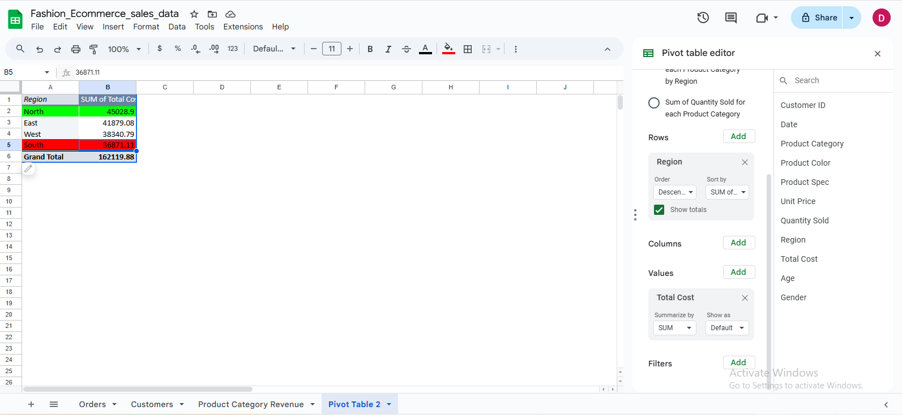
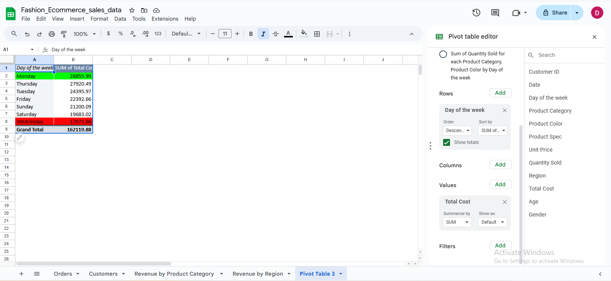
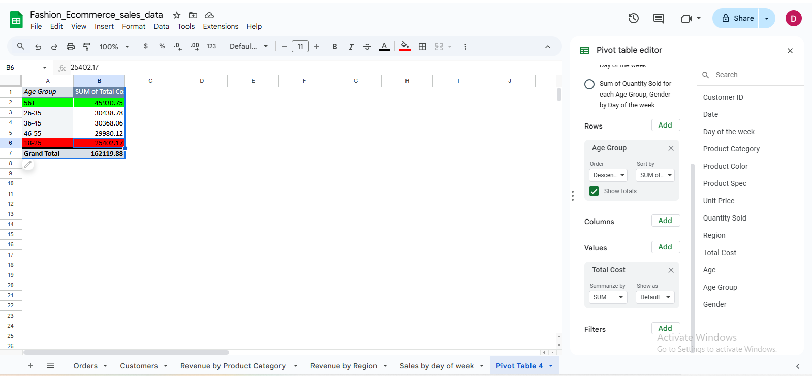
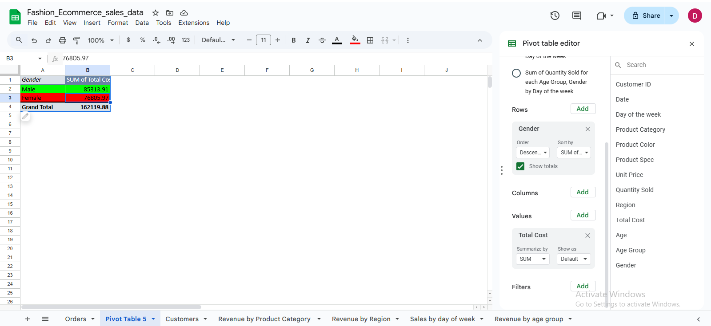

# 🛍️ Fashion Store Sales Insights

## 📌 Project Overview
This is a live Google Sheets project exploring fashion store sales over the past 12 months. I’m cleaning and analyzing the data to uncover trends, patterns, and insights using pivot tables and formulas.

Stay tuned — I’ll be documenting each step here as I go!

---

## 🧰 Tools Used
- Google Sheets
- Screenshots (from HP laptop)
- GitHub

## 📊 SMART Questions

1. Which product category generated the most revenue in the last 12 months?
2. Which region brought in the highest and lowest total revenue?
3. What day of the week had the highest and lowest sales?
4. Which age group brought in the most revenue?
5. Which gender brought in the most revenue?

---

## 📁 Dataset Description

This project uses two datasets:

- **Sales Sheet:** Contains transaction details like date, product category, quantity sold, and unit price.
- **Customers Sheet:** Contains customer ID, gender, age, and region.

---

## 🧼 Data Cleaning Process

All cleaning was done in Google Sheets. Key steps included:

1. Removed blank cells using the filter tool  
2. Removed duplicates with the Data Cleanup tool  
3. Split the Date/Time column and deleted the Time section  
4. Formatted the Date column properly  
5. Cleaned text in the Gender column using the `=PROPER()` function  
6. Used `VLOOKUP()` to bring in age and gender columns from the customers sheet  
7. Deleted rows with missing customer details  
8. Created age groups using a nested `IFS()` formula  
9. Replaced all formula columns with their pasted values  

Screenshots of the process are available in the `screenshots` folder.

---

## 🖼️ Key Screenshots

### 1. Data Cleaning Process
- Using the `=PROPER()` function to clean gender column  
  

- Final cleaned version after removing blanks and duplicates  
  

- Final merged dataset  
  

---

### 2. Pivot Table Insights

- Revenue by Product Category  
  

- Revenue by Region  
  

- Revenue by Day of the Week  
  

- Revenue by Age Group  
  

- Revenue by Gender  
  

---

## 💡 Reflections & Lessons Learned

This project helped me practice essential skills in spreadsheet-based data analysis. Here's what I learned:

- How to clean messy data using filters, formulas like `=PROPER()`, and the data cleanup tool in Google Sheets
- How to use `VLOOKUP()` to merge datasets from different sheets
- How to use pivot tables to uncover insights and answer business questions
- The importance of structuring projects clearly and documenting my process
- How to use GitHub to organize and present a portfolio project

As a beginner, I feel more confident handling real-world datasets and presenting my work in a professional way. This project also taught me the value of screenshots and clear storytelling — something I’ll apply to future case studies!

## Dataset

You can download the cleaned dataset used in this project [here](https://github.com/dimma-analytics/fashion-store-sales-insights/blob/main/datasets/Fashion_Ecommerce_sales_data%20(1).xlsx).

